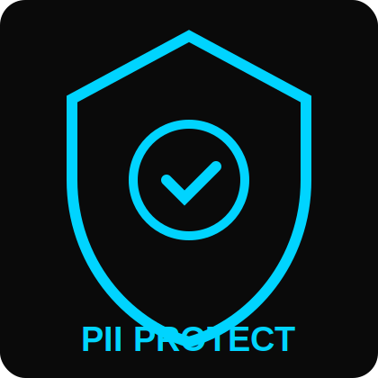

<p align="center">
  
</p>

<h1 align="center">🛡️Cyprus : PII Protect System</h1>
<p align="center"><i>AI-Powered Sensitive Data Detection, Masking & Secure Document Management</i></p>

<p align="center">
  
  
  
  
  
  
  
  
  
  
  
</p>

---

# 🌟 Overview

**PII Protect System** is a secure web platform designed to detect, mask, encrypt, and manage **Personally Identifiable Information (PII)** from user-uploaded documents.

Using **OCR**, **AI-based PII detection**, and **AES-256 encryption**, the system enables:

- Safe document upload  
- Automatic PII extraction  
- User-controlled masking/revealing  
- Secure encrypted storage  
- Manager-level controlled access  

---

# 🔄 System Workflow


```
User Upload → OCR → PII Detection → Masking → Encryption → Secure Storage → Manager Access
```

---

# ✨ Features

| Feature | Description |
|--------|-------------|
| **OCR Extraction** | Uses Tesseract to read text from images |
| **PII Detection** | Detects Aadhaar, PAN, phone, email, address, etc. |
| **Custom Masking** | Partially or fully masks sensitive elements |
| **User Access Control** | User decides if the PII should be revealed or hidden |
| **Manager Verification System** | Manager must authenticate using ID |
| **AES-256 Encryption** | Every extracted PII text is encrypted |
| **Secure Blob Storage** | Masked files stored as encrypted blob objects |
| **Audit Logs** | Tracks every access request |

---

# 🏗️ Architecture

```
┌─────────────────────────────────────────────┐
│                   FRONTEND                  │
│   HTML • CSS • JavaScript (User Interface)  │
└─────────────────────────────────────────────┘
                    │
                    ▼
┌─────────────────────────────────────────────┐
│                    API LAYER                │
│      Django Backend + Node.js Services      │
└─────────────────────────────────────────────┘
                    │
                    ▼
┌─────────────────────────────────────────────┐
│                OCR & PII ENGINE             │
│   Tesseract OCR + Rule/Model-based PII DET  │
└─────────────────────────────────────────────┘
                    │
                    ▼
┌─────────────────────────────────────────────┐
│          ENCRYPTION & STORAGE LAYER         │
│      AES-256 Encryption + Blob Storage      │
└─────────────────────────────────────────────┘
                    │
                    ▼
┌─────────────────────────────────────────────┐
│              MANAGER ACCESS SYSTEM          │
│       Identity Validation + Secure Access   │
└─────────────────────────────────────────────┘
```

---

# 🛠️ Technology Stack

### Frontend  
- HTML  
- CSS  
- JavaScript  

### Backend  
- Django  
- Node.js  
- MySQL  

### Security  
- AES-256 encryption  
- Blob storage  
- Access control  
- Audit logs  

---

# 🎥 Demo Screenshots

> Replace these with real app screenshots.

### Upload UI  


### OCR + PII Detection  


### Manager Login  


### Masked Document  


---

# 🔒 Security & Compliance

- DPDP Act 2023 Compliant  
- IT Act & SPDI Rules  
- AES-256 Industry Encryption  
- Zero-Trust Workflow  

---

# ⚠️ Challenges

1. DPDP compliance complexity  
2. Low user awareness  
3. Managerial misuse risks  
4. Cyberattacks despite encryption  

---

# 🎯 Impact

- Protects sensitive Indian identity documents  
- Reduces fraud & identity theft  
- Builds trust in digital document workflows  
- Useful for universities, HR, banks, govt offices  

---

# 🚀 Future Enhancements

- AI-based PII classification  
- Multi-language OCR  
- Role-based dashboards  
- Cloud storage encryption  
- Real-time redaction  

---

# 📜 License

MIT License.
